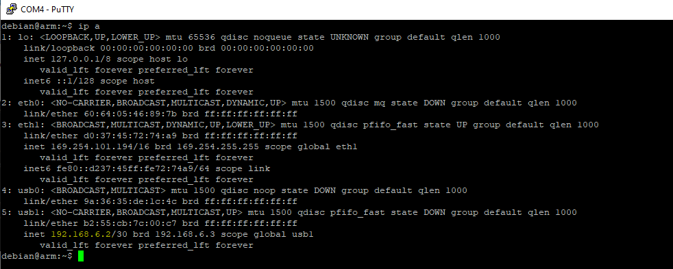
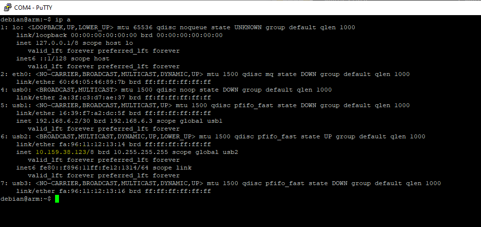

I haven't touched my custom Linux board project in a while 
( <https://protoni.fi/Projects/Electronics/osd3358-linux/> ) so I thought that it was
about time to start actually doing something with it. 

I ordered a bunch of these
prototyping/development boards from MikroElektronika ( https://www.mikroe.com/ ) 
called **"Click boards"** and started messing around with them.

A lot of configuring and figuring out was required so here are some notes on that.

**Click boards**


---

### Ethernet

Not a Click board, but the first issue I had was that I couldn't really move files over to the Linux 
system and command line editors didn't work all that well over UART.

I only had access to the board through USB client or UART pin 
as a COM port using Putty so I bought this ~9€ USB -> Ethernet adapter to solve this issue. 
It just works out of the box. Just needed to plug it in, figure out the IP address of the Linux board and SSH in to it.


**Ethernet adapter**


**Internet connection works**

The RJ45 adapter is also great because the beaglebone Linux has a package management system so I can just install whatever
I need using apt-get now that I have internet connection working.


**Getting the IP**

There is no ifconfig on beaglebone linux, apparently it only has a **ip a** command.
( IP highlighted in yellow )


**SSH in to the device**
```

# Open Putty

Host name:
debian@192.168.1.60

Port: 
22

```


**Connecting ethernet cable straight to host**

I have a router where my computer and the Linux board is connected so I didn't have to set any
IP settings on the host machine. But here are some notes on that as well.


**Get the IP**




**Configure the IP and connect**
```
- Connect the cable to the host machine
- Win + R -> ncpa.cpl
- Right click the TP Link adapter -> Properties -> Internet Protocol Version 4 (TCP/IPv4)
-> Properties -> General -> Use the following IP address:
-- IP address:      192.168.6.5
-- Subnet mask:     255.255.255.0
-- Default gateway: 192.168.6.0
```


Not sure why, but I had to reboot the Linux board first to make the settings work.
I also had to ping from the Linux device to my host machine first to make the ping work the other way too.
Not sure if this is due to some Windows firewall settings or what.


---

### LTE modem

The LTE modem Click board that I have is this one:
* https://www.mikroe.com/lte-cat1-eu-click-for-europe

It has an **Cinterion ELS61** modem chip in it. Docs:
* https://m2m.dk/wp-content/uploads/2019/12/ELS61-E-AT-Command-Set-V02.000-15.08.2018.pdf

I had a lot of issues with getting a mobile interface on linux setup with the modem and in the end I didn't get it
to work through the UART pins that are in the Click board headers. It probably requires some drivers to actually work.

Instead I connected a micro USB cable from the Linux board's USB host port to the
Click board's USB client port.


**USB connected to modem**


**Setting up the mobile interface**

I spent quite a while hopelessly searching the net to solve the issues that I had with the modem internet connection setup.
The modem itself worked right away. I got a pre-paid SIM card from the nearest kiosk just before it closed at 10pm 
so I got to test the modem right away. I tested the modem by calling from it to my own cell phone.

The first port on Linux board that I tested was **/dev/ttyACM0**. The **minicom**
connection seemed to open and all of the AT commands seemed to work except **AT^SWWAN** that is supposed to open the internet connection.

**Minicom modem connection works**


By default, it just gave an error called **"Error"**, but after digging around I was able to set an
extended error mode on, which can be set on with this command:
```
AT+CMEE=2
```

Errors can be queried with this:
```
AT+CEER
```


After setting the extended settings mode I was getting 2 types of errors:
```
CME ERROR: 100
```
And the other one was:
```
+CME ERROR: operation not allowed
```


Never solved those issues, I just happened to test the **/dev/ttyACM1** after battling with this for a while and it worked!

**Setup mobile interface**

The **internet** parameter is the **APN** of the operator.
```
1. Connect USB host -> Click board USB client with a USB cable
2. sudo minicom -o -D /dev/ttyACM1 -b 115200
3. AT+CGDCONT=1,"IP","internet"
4. AT^SWWAN=1,1
5. Exit with Ctrl + A -> X -> Yes
6. sudo ping google.com
7. ip a
```


**The mobile connection works**


**Mobile interface**



Before I decided to test the USB, I spent hours on trying to make the UART route work.
I found only 2 other people on some forums who seemed to have a similar error. Last posts to those threads
were from years ago and no responses after that.. frustrating. I guess they gave up too.

These were some of the errors I got:
```
PDP context deactivation
```
```
Last PDN disconnection not allowed
```
```
Unknown error
```


After I had spent the whole night trying to solve these errors I happened to
get it to work with the **/dev/ttyACM1** way explained earlier.


**Some minicom notes**
```
### Minicom ###
# Minicom enable carriage return new lines
Ctrl + A -> U

# Minicom quit
Ctrl + A -> X -> Yes

# Minicom enable echo
Ctrl + E

# Minicom clear screen
Ctrl + A -> C
```

---

### Temperature

The temperature Click board that I got is this one:
* https://www.mikroe.com/thermo-14-click.

It has an **STTS22H** temperature sensor IC in it.

The first problem was that the **Beaglebone Linux** that I'm running on the board currently didn't have
**I2C1** bus, that I have routed to the **Click board headers**. It had to be configured in the **device tree**
and that was an whole nother journey. I'll probably do a separate post for the device tree tuning.

After getting the I2C1 bus working, it was possible to get access to the temperature sensor.

**List i2c buses**
```
debian@arm:~$ /usr/sbin/i2cdetect -l
i2c-1   i2c             OMAP I2C adapter                        I2C adapter
i2c-2   i2c             OMAP I2C adapter                        I2C adapter
i2c-0   i2c             OMAP I2C adapter                        I2C adapter

```


**Probe i2c1 bus**

Here we can see that the temperature sensor **0x3f** is detected. **"--"** means that
no devices were found. **"UU"** can also be found sometimes, it means that it is an reserved address.


**Reading temperature values**

I found a python program for some other I2C temperature sensor online, so I modified it to
be able to read the temperature from the **STTS22H** as well.
```python
import time
import smbus

# I2C channel
i2c_ch = 1

# STTS22H address on the I2C bus
i2c_address = 0x3f

# Register addresses
reg_temp_l = 0x06 # Low temperature bytes
reg_temp_h = 0x07 # High temperature bytes
reg_config = 0x04 # Control settings register

# Control register settings
ctrl_reg = 0xAA

# Read temperature registers and calculate Celsius
def read_temp():

    # Read temperature registers
    val_l = bus.read_i2c_block_data(i2c_address, reg_temp_l, 1)
    val_h = bus.read_i2c_block_data(i2c_address, reg_temp_h, 1)
    
    # Combine high and low registers
    temperature = (val_h[0] << 8) | val_l[0]

    # Convert to celcius
    return temperature / 100.0

# Initialize I2C
bus = smbus.SMBus(i2c_ch)

# Print old control register value
val = bus.read_i2c_block_data(i2c_address, reg_config, 1)
print("Old control register value:", val)

# Set configs
val[0] = ctrl_reg
bus.write_i2c_block_data(i2c_address, reg_config, val)

# Print new control register value
val = bus.read_i2c_block_data(i2c_address, reg_config, 1)
print("New control register value:", val)

# Print temperature value in a loop
while True:
    print("Current temperature: " + str(read_temp()), "C")
    time.sleep(1)
```


**Running the script**


---

### GPS

The Click board that I got for GPS location reading is this one:
* https://www.mikroe.com/gps-4-click

It contains a **Quectel L70** GPS chip and it can be communicated with trough UART.


**Setting up gpsd**
```bash
sudo apt-get install gpsd gpsd-clients
```


**Output GPS data to see that the chip works**

At this point some data should already be seen in the terminal if the device works and correct **tty**
port is used.
```bash
sudo cat /dev/ttyS0
```


**Disable gpsd that uses the default settings**
```bash
sudo systemctl stop gpsd.socket
sudo systemctl disable gpsd.socket
```


**Set permissions and user groups for gpsd**
```bash
sudo usermod -a -G dialout gpsd
sudo chown root:dialout /dev/ttyS0
```


**I keep getting these errors still**
```
Oct 22 14:36:12 arm gpsd[1329]: gpsd:ERROR: SER: device open of /dev/ttyS0 failed: Permission denied - retrying read-only
Oct 22 14:36:12 arm gpsd[1329]: gpsd:ERROR: SER: read-only device open of /dev/ttyS0 failed: Permission denied
Oct 22 14:36:12 arm gpsd[1329]: gpsd:ERROR: /dev/ttyS0: device activation failed.
Oct 22 14:36:12 arm gpsd[1329]: gpsd:ERROR: /dev/ttyS0: activation failed, freeing device
```


**A hacky fix to make it actually work. Fix later.**
```bash
sudo mv /dev/ttyS0 /dev/ttyS1
sudo chmod 666 /dev/ttyS1
```


**Start the daemon**
```bash
sudo rm /var/run/gpsd.sock
sudo gpsd /dev/ttyS1 -F /var/run/gpsd.sock
```


**GPS monitoring tools**
```bash
sudo gpsmon
sudo cgps -s
```


**gpsmon**

I don't have a GPS antenna, so gps can't see any satellites ( Quality and Sats field )


---

### Wifi

Not a Click board, but I remembered that I bought this wifi module some years ago and decided
to test it as well:
* https://components101.com/development-boards/nodemcu-esp8266-pinout-features-and-datasheet

It has an **ESP-12E** module containing a **ESP8266** chip which includes a 
**Tensilica Xtensa 32-bit LX106** RISC microprocessor. NodeMCU has 128 KB RAM and 4MB of Flash memory.


**Connected via UART pins**


**Flashing the firmware**

I found this **"slip router"** project from github which allows me to
setup a Linux interface to communicate with the Wifi chip.
* https://github.com/martin-ger/esp_slip_router

I went on and started setting up the **ESP SDK** so that I could build the slip router. Later on I realized that
the github repo has the pre built binaries already. But now that I have the SDK setup, I can
for example change the UART baud rate and so on.

**Setup ESP SDK**
```bash
git clone https://github.com/pfalcon/esp-open-sdk
sudo apt-get install make unrar-free autoconf automake libtool gcc g++ gperf \
    flex bison texinfo gawk ncurses-dev libexpat-dev python-dev python python-serial \
    sed git unzip bash help2man wget bzip2
sudo apt-get install libtool-bin
cd esp-open-sdk
make
export PATH="/PATH_TO_ESP_PROJECT/esp-open-sdk/xtensa-lx106-elf/bin:$PATH"
```


**Build the slip router and flash the firmware**

```bash
cd ..
git clone https://github.com/martin-ger/esp_slip_router
cd esp_slip_router
make
make flash
```


**Setting up the wifi interface**
```bash
sudo slattach -L -p slip -s 115200 /dev/ttyS0&
sudo ifconfig sl0 192.168.240.2 pointopoint 192.168.240.1 up mtu 1500
sudo route add -net 192.168.4.0/24 gw 192.168.240.1
telnet 192.168.240.1 7777
CMD>set ap_ssid ESP8266 
CMD>set ap_password temppwd
CMD>set use_ap 1
CMD>save
CMD>reset
```


**The "slip" interface on Linux**


**Testing SSH with termux on Android, it works !**

I enabled wifi on my phone, the ESP8266 access point showed up and I was able to connect to it.


**I also tried to flash the firmware on the target Linux board**
```
termios.error: (25, 'Inappropriate ioctl for device')
```


**Not sure if this is even supposed to be possible, but here's the command I tried**
```bash
sudo esptool.py --port /dev/ttyS0 write_flash -fs 4MB 0x00000 firmware/0x00000.bin 0x10000 firmware/0x10000.bin
```


It failed. And I'm not sure if it's just an coincidence or did it break something,
but now when I try to for example update the board with **apt-get**, it gives me this error 😳
```
Reading package lists... Error!
E: lzma_read: Read error (10)
W: You may want to run apt-get update to correct these problems
E: The package cache file is corrupted
```


Quick google search suggested that it is caused by some python serial module mismatch and to
resolve, I should install:
```bash
sudo apt-get install python-serial
```


This is where I noticed the **lzma_read** error above.
Need to investigate more.


---

### Accelerometer and Gyroscope

**!NOT DONE YET!**

Couldn't get the accelerometer working yet. I'll update this post if and when I can see
some progress with this.

I was able to build this driver for the chip:
* https://github.com/BoschSensortec/BMI270-Sensor-API


**Initialization results in error**

The driver is able to at least read some I2C registers before failing to 
this configuration loading check with this error:
```
Error -9 : Configuration loading error
```

If solving this begings to take too long, I'll probably test the driver with SPI bus.
For that I need to modify the device tree again and add the SPI to it.


---

### CAN

**!NOT DONE YET!**

The **AM335x** processor already has 2 CAN buses, but they are not currently routed to anywhere
on the board.

This is the CAN board:
* <https://www.mikroe.com/mcp25625-click>


---


