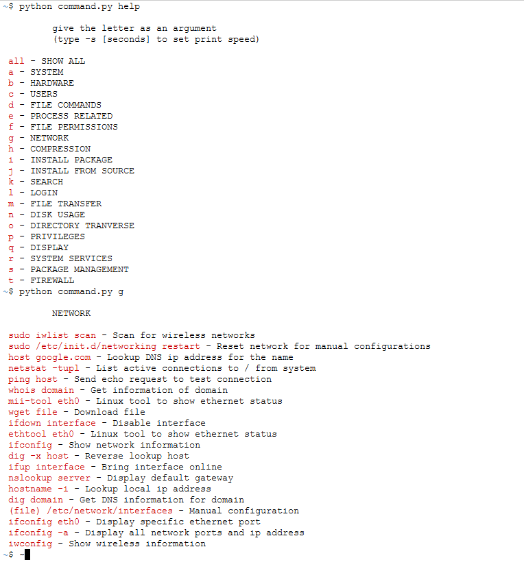

I was browsing my cloud storage and found some old stuff from years 2014-2015, around when I started to learn programming.
They are scattered all over the place inside countless of sub folders and tar archives so I thought it would be nice to organize some
of them for easier access.

I'm going to add here only some of the projects I found because most of them are not really too interesting visually and also it would take
a lot of time to set the environments up for these to build and run. So basically only some python and web stuff will be found here. Maybe I'll add
all them to GitHub for example in the future.


---

### Python games
After some work I got these python 'games' to run. These are basically the first things I did when I  first started to learn programming. 
I did some CodeCademy course first to get started with the syntax and then moved to doing something on my own. They use **pygame** to draw the graphics.

I put these in order based on when I made them, oldest is first one in the list.

- [Ball thing](#ball-thing)
- [Block thing](#block-thing)
- [Block game](#block-game)
- [Shooter game](#shooter-game)
- [RPG](#rpg)

### Ball thing

Not really a game but first test on how to draw things to the screen. Seems to have at least collision detection in the borders.


The code seems to be a weird mixture of finnish and english.
````python
import pygame, sys
from random import randint
pygame.init()
screen = pygame.display.set_mode((1028, 480))

class Pallo(object):
    def __init__(self, pos):
        self.color = self.color()
        self.pos = pos
        self.radius = self.radius()
        self.thickness = 0
        self.paikka = self.paikka()
        self.x = 0
        self.y = 5
        
    def color(self):
        color = []
        for x in range(3):
            x = randint(0, 255)
            color.append(x)
        return color[:]
    
    def paikka(self):
        paikka = []
        paikka.append(self.pos[0])
        paikka.append(self.pos[1])	
        return paikka[:]
        
    def radius(self):
        
        return randint(10, 100)
    
    def update(self):
        self.collision()
        self.paikka[0] += self.x
        self.paikka[1] += self.y
        
    
    def collision(self):
        '''wall collision'''
        if self.paikka[0] < 0 + self.radius:
            self.x = 5
        elif self.paikka[0] > 1028 - self.radius:
            self.x = -5
        elif self.paikka[1] < 0 + self.radius:
            self.y = 5
        elif self.paikka[1] > 480 - self.radius:
            self.y = -5

pallot = []
pallo_coords = []

while True:
    clock = pygame.time.Clock()
    clock.tick(30)
    pos = pygame.mouse.get_pos()
    for event in pygame.event.get():
        if event.type == pygame.QUIT:
            sys.exit()
        if event.type == pygame.MOUSEBUTTONDOWN:
            pallo = Pallo(pos)
            pallot.append(pallo)
    
                    
    screen.fill((255, 255, 255))
    for i in pallot:
        pygame.draw.circle(screen, i.color, i.paikka, i.radius, i.thickness)
        i.update()
        
    pygame.display.flip()
````


### Block thing
This is basically the same as **ball thing**, but has collision detection between objects flying around and the color
changes on collision.


Ze code
````python
import pygame, sys
from random import randint
pygame.init()
screen = pygame.display.set_mode((1028, 480))


class Palikka(pygame.sprite.Sprite):
    def __init__(self, color, size, pos):
        pygame.sprite.Sprite.__init__(self)
        self.width, self.height = size
        
        # create rectangle
        self.image = pygame.Surface((self.width, self.height))
        self.image.fill((color))
        self.rect = self.image.get_rect()
        
        # starting point for the block. created with mouse click.
        self.rect.x = pos[0] - self.width / 2
        self.rect.y = pos[1] - self.height / 2
        
        # change the speed of the block (30fps x pixels)
        self.speed = 5
        
        # speed vectors
        self.x = 0
        self.y = self.speed
        
            
    def update(self):
        # create copy for block collision detection
        last = self.rect.copy()
        
        # move block
        self.rect.x += self.x
        self.rect.y += self.y
        
        # check to see that the block can change color after being hit
        self.block_hit = False
        
        # wall collision
        if self.rect.x < 0:
            self.x = self.speed
            self.block_hit = True
        elif self.rect.x > 1028 - self.width:
            self.x = -self.speed
            self.block_hit = True
        elif self.rect.y < 0:
            self.y = self.speed
            self.block_hit = True
        elif self.rect.y > 480 - self.height:
            self.y = -self.speed
            self.block_hit = True
            
            
        # block collision
        global palikat
        new = self.rect
        block_hit_list = pygame.sprite.spritecollide(self, palikat, False)
        for cell in block_hit_list:
            cell = cell.rect
            if last.right <= cell.left and new.right > cell.left:
                new.right = cell.left
                self.x = -self.speed
                self.block_hit = True
            if last.left >= cell.right and new.left < cell.right:
                new.left = cell.right
                self.x = self.speed
                self.block_hit = True
            if last.bottom <= cell.top and new.bottom > cell.top:
                new.bottom = cell.top
                self.y = -self.speed
                self.block_hit = True
            if last.top >= cell.bottom and new.top < cell.bottom:
                new.top = cell.bottom
                self.y = self.speed	
                self.block_hit = True
                
            # change the color of the block	
            if self.block_hit == True:
                self.image.fill(color())
                
                    
# get random color
def color():
    color = []
    for x in range(3):
        x = randint(0, 255)
        color.append(x)
    return color[:]

# get random size
def get_size():
    
    return randint(10, 50), randint(10, 50)
    
    

palikat = pygame.sprite.Group()

# main loop
while True:
    clock = pygame.time.Clock()
    clock.tick(30)
    screen.fill((255, 255, 255))
    pos = pygame.mouse.get_pos()
    for event in pygame.event.get():
        if event.type == pygame.QUIT:
            sys.exit()
        if event.type == pygame.MOUSEBUTTONDOWN:
            palikka = Palikka(color(), get_size(), pos)
            palikat.add(palikka)
                
    
    palikat.update()
    palikat.draw(screen)
    pygame.display.flip()
````


### Block game
Getting some sort of game elements in


````python
import pygame, sys
from random import randint
import math
pygame.init()
screen = pygame.display.set_mode((1028, 480))


class Walls(pygame.sprite.Sprite):
    def __init__(self, pos):
        pygame.sprite.Sprite.__init__(self)
        self.width = 15
        self.height = 15
        self.image = pygame.Surface((self.width, self.height))
        self.image.fill((0, 200, 0))
        self.rect = self.image.get_rect()
        self.rect.x = pos
        self.rect.y = 480 - self.height
        
# make walls for the game
wall_list = pygame.sprite.Group()
def make_walls():
    for i in range (0, 1028, 15):
        wall = Walls(i)
        wall_list.add(wall)
make_walls()

class Player(pygame.sprite.Sprite):
    def __init__(self):
        pygame.sprite.Sprite.__init__(self)
        self.width = 15
        self.height = 15
        self.image = pygame.Surface((self.width, self.height))
        self.image.fill((0, 0, 0))
        self.rect = self.image.get_rect()
        
        # starting point for the player.
        self.rect.x = 500
        self.rect.y = 200
        
        #gravity
        self.resting = False
        self.dy = 0
        #speed
        self.speed = 5
        
    def update(self, dt, wall_list, palikat):
        key = pygame.key.get_pressed()
        last = self.rect.copy()
        if key[pygame.K_a]:
            self.rect.x -= 300 * dt
        if key[pygame.K_d]:
            self.rect.x += 300 * dt
        if self.resting and key[pygame.K_SPACE]:
            self.dy = -500
                
        self.dy = min(400, self.dy + 40)
        self.rect.y += self.dy * dt
        
        
        # check collision with walls
        new = self.rect
        self.resting = False
        block_hit_list = pygame.sprite.spritecollide(self, wall_list, False)
        for cell in block_hit_list:
            cell = cell.rect
            if last.right <= cell.left and new.right > cell.left:
                new.right = cell.left
                
            if last.left >= cell.right and new.left < cell.right:
                new.left = cell.right
                
            if last.bottom <= cell.top and new.bottom > cell.top:
                self.resting = True
                new.bottom = cell.top
                self.dy = 0
                
            if last.top >= cell.bottom and new.top < cell.bottom:
                new.top = cell.bottom
                self.dy = 0
                
        # check collision with blocks	
        block_hit_list = pygame.sprite.spritecollide(self, palikat, False)
        for cell in block_hit_list:
            cell = cell.rect
            if last.right <= cell.left and new.right > cell.left:
                new.right = cell.left
                            
            if last.left >= cell.right and new.left < cell.right:
                new.left = cell.right
                
            if last.bottom <= cell.top and new.bottom > cell.top:
                self.resting = True
                new.bottom = cell.top
                self.dy = 0
            
            if last.top >= cell.bottom and new.top < cell.bottom:
                new.top = cell.bottom
                self.dy = 0

class Palikka(pygame.sprite.Sprite):
    def __init__(self, pos):
        pygame.sprite.Sprite.__init__(self)
        self.width, self.height = 15, 15
        
        # create rectangle
        self.image = pygame.Surface((self.width, self.height))
        self.image.fill((0, 200, 0))
        self.rect = self.image.get_rect()
        
        # starting point for the block. created with mouse click.
        self.rect.x = pos[0] - self.width / 2
        self.rect.y = pos[1] - self.height / 2
        
        # change the speed of the block (30fps x pixels)
        self.speed = 5
        
        # speed vectors
        self.x = 0
        self.y = self.speed
        
            
    def update(self, wall_list, bullet_list):
        # create copy for block collision detection
        last = self.rect.copy()
        
        # move block
        self.rect.x += self.x
        self.rect.y += self.y
        
        new1 = self.rect
        # wall collision
        global palikat
        block_hit_list = pygame.sprite.spritecollide(self, palikat, False)
        for cell in block_hit_list:
            cell = cell.rect
            if last.right <= cell.left and new1.right > cell.left:
                new1.right = cell.left
                
            if last.left >= cell.right and new1.left < cell.right:
                new1.left = cell.right
                
            if last.bottom <= cell.top and new1.bottom > cell.top:
                new1.bottom = cell.top
                
            if last.top >= cell.bottom and new1.top < cell.bottom:
                new1.top = cell.bottom
            
        # block collision
    
        new = self.rect
        block_hit_list = pygame.sprite.spritecollide(self, wall_list, False)
        for cell in block_hit_list:
            cell = cell.rect
            if last.right <= cell.left and new.right > cell.left:
                new.right = cell.left
                
            if last.left >= cell.right and new.left < cell.right:
                new.left = cell.right
                
            if last.bottom <= cell.top and new.bottom > cell.top:
                new.bottom = cell.top
                
            if last.top >= cell.bottom and new.top < cell.bottom:
                new.top = cell.bottom
                
            new1 = self.rect
        # wall collision
        
        pygame.sprite.spritecollide(self, bullet_list, True)

class Bullet(pygame.sprite.Sprite):
    def __init__(self, pos, player):
        pygame.sprite.Sprite.__init__(self)
        self.width = 10
        self.height = 10
        self.image = pygame.Surface((self.width, self.height))
        self.image.fill((255, 0, 0))
        self.rect = self.image.get_rect()
        self.pos = pos
        self.rect.x = player[0] - Player().width / 2
        self.rect.y = player[1]
        self.move_x = 0
        self.move_y = 0
        
        self.mouse_x, self.mouse_y = pos[0], pos[1]
        self.player = player
    
    def update(self, palikat):
        speed = 20.
        
        distance = [self.mouse_x - self.player[0], self.mouse_y - self.player[1]]
        norm = math.sqrt(distance[0] ** 2 + distance[1] ** 2)
        direction = [distance[0] / norm, distance[1 ] / norm]
        bullet_vector = [direction[0] * speed, direction[1] * speed]
        self.rect.x += bullet_vector[0]
        self.rect.y += bullet_vector[1]
            
        if self.rect.x < 0:
            pygame.sprite.Group.remove(bullet_list, self)
        if self.rect.x > 1028:
            pygame.sprite.Group.remove(bullet_list, self)
        if self.rect.y < 0:
            pygame.sprite.Group.remove(bullet_list, self)
        if self.rect.y > 480:
            pygame.sprite.Group.remove(bullet_list, self)
        
        # remove bullet when it hits a block
        pygame.sprite.spritecollide(self, palikat, True)
        
        
bullet_list = pygame.sprite.Group()	

palikat = pygame.sprite.Group()

player_list = pygame.sprite.Group()
player_in_game = False

bullet_counter = 0
# main loop
while True:
    clock = pygame.time.Clock()	
    dt = clock.tick(30)
    screen.fill((255, 255, 255))
    pos = pygame.mouse.get_pos()
    mouse = pygame.mouse.get_pressed()
    key = pygame.key.get_pressed()
    for event in pygame.event.get():
        if event.type == pygame.QUIT:
            sys.exit()
            
    if key[pygame.K_LCTRL]:
        if player_in_game == False:
            player = Player()
            player_list.add(player)
            player_in_game = True
            
    if mouse[2]:
        palikka = Palikka(pos)
        palikat.add(palikka)
    
    if bullet_counter > 20:
        if mouse[0]:
            bullet = Bullet(pos, [player.rect.x, player.rect.y])
            bullet_list.add(bullet)
            bullet_counter = 0
    
    
    wall_list.draw(screen)
    
    #limit the bullet count
    bullet_counter += 10
    
    bullet_list.update(palikat)
    bullet_list.draw(screen)
    
    player_list.update(dt / 1000., wall_list, palikat)
    player_list.draw(screen)
    
    palikat.update(wall_list, bullet_list)
    palikat.draw(screen)
    pygame.display.flip()
````


### Shooter game
Out of all these pygame programs this is the only one that really can be counted as a game because it has some sort of game mechanics.
The game even has a hiscore saving/loading system and difficulty levels! The idea is to kill as many monsters as possible, the rate they spawn in increases
as the game goes on.


The code begins to be pretty spaghetti at this point. Also theres 700+ code lines so I added this to github for easier reading.
- <https://github.com/protoni/legacy-stuff/blob/master/python_games/shooter/rpg.py>


### RPG
I managed to get this to work after some setting up. Had to setup python 2.7 environment and install python 2.7 modules alongside my python v3.8 setup.

I still remember that I had difficulties getting the world and camera coordinate system to work in this one.
Also the character animation was difficult for me to implement.

Unfortunately the game never got finished.

<dl>
  <video width="640" height="480" controls>
    <source src="rpg.mp4" type="video/mp4">
  </video>
</dl>

At this point I had already started to split the project into smaller files as the project grew:
- <https://github.com/protoni/legacy-stuff/tree/master/python_games/RPG>


### Web stuff
- [Raspberry Pi system monitor](#raspberry-pi-system-monitor)
- [Music controller](#music-controller)

### Raspberry Pi system monitor
I had no idea about modern web development techniques so I was building website with pure **HTML**, **CSS** and some **PHP**.

I really liked messing around with **raspberry pi's** back then and I wanted to monitor them more easily as they were running 24/7 and was publicly accessible.

With this monitor I could see the system status more easily. The site would parse system resources, fail2ban logs, ssh logs, open ports and such. If I remember
correctly there was more tabs with more features on later versions, but I guess I didn't save those.

This is the version 1.1. There is another earlier version 1.0 as well, but I don't have any pictures of that and I don't have any system to run it properly at this time.

Some earlier version:


Monitor page:


Repository:
<https://github.com/protoni/legacy-stuff/tree/master/www/monitor1.1>


### Music controller
This is a simple PHP web page that would control music player through a FIFO system on linux. I don't really 
remember much about this or how it worked, but the FIFO system seems interesting.

I don't have a preview image or really anything to show other than the code.

omx.php
````html
<?php
    if(isset($_POST['play']))
    {
        if(!file_exists('/tmp/omx')) exec('mkfifo /tmp/omx');
        exec('php run.php > /dev/null &');
        exec("echo . > /tmp/omx");
    }
    
    if(isset($_POST['pause']))
    {
        shell_exec('echo -n p > /tmp/omx');
    }
    
    if(isset($_POST['stop']))
    {
        shell_exec('echo -n q > /tmp/omx');
    }
    
    if(isset($_POST['volUp']))
    {
        shell_exec('echo -n + > /tmp/omx');
    }
    
    if(isset($_POST['volDown']))
    {
        shell_exec('echo -n - > /tmp/omx');
    }
    
    
    
?>

<html>
    <body>
        <form action="" method="post">
            <p>Play fuel.mp3 with omxplayer</p>
            <button type="submit" name="play">Play</button>
        </form>
        <form action="" method="post">
            <button type="submit" name="pause">Pause</button>
        </form>
        <form action="" method="post">
            <button type="submit" name="stop">Stop</button>
        </form>
        <form action="" method="post">
            <button type="submit" name="volUp">Vol up</button>
        </form>
        <form action="" method="post">
            <button type="submit" name="volDown">Vol down</button>
        </form>
    </body>
</html>
````

run.php
````html
<?php

exec('sudo omxplayer -ohdmi /home/pitoni/fuel.mp3 < /tmp/omx');

?>
````


---


### Linux stuff

- [Linux command helper](#linux-command-helper)

### Linux command helper
I was starting to use Linux for the first time around the same time when I was learning programming 
and I couldn't remember many of the commands so I made this to help me.


Sources:
````python
#!/usr/bin/env python
# script to view terminal commands
import subprocess
import time
import argparse


system = {'uname -a' : 'Display linux system information',
			'uname -r' : 'Display kernel release information',
			'uptime' : 'Show how long the system has been running + load',
			'hostname' : 'Show system hostname',
			'hostname -i' : 'Display the IP address of the host',
			'last reboot' : 'Show system reboot history',
			'date' : 'Show the current date and time',
			'cal' : 'Show this month calendar',
			'w' : 'Display who is online',
			'whoami' : 'Who you are logged in as',
			'finger user' : 'Display information about user',
			'Recovery' : 'Type the phrase "REISUB" while holding down Alt and SysRq(PrintScrn) with about 1 second between each letter. Your system will reboot.',
			'lsb_release -a' : 'Get Ubuntu version',
			'uname -r' : 'Get kernel version',
			'uname -a' : 'Get all kernel information',
			'title' : 'SYSTEM'}

hardware = {'dmesg' : 'Detected hardware and boot messages',
			'cat /proc/cpuinfo' : 'CPU model',
			'cat /proc/meminfo' : 'Hardware memory',
			'cat /proc/interrupts' : 'Lists the number of interrupts per CPU per I/O device',
			'lshw' : 'Displays information on hardware configuration of the system',
			'lsblk' : 'Displays block device related information in Linux',
			'free -m' : 'Used and free memory (-m for MB)',
			'lspci -tv' : 'Show PCI devices',
			'lsusb -tv' : 'Show USB devices',
			'dmidecode' : 'Show hardware info from the BIOS',
			'hdparm -i /dev/sda' : 'Show info about disk sda',
			'hdparm -tT /dev/sda' : 'Do a read speed test on disk sda',
			'badblocks -s /dev/sda' : 'Test for unreadable blocks on disk sda',
			'title' : 'HARDWARE'}
			
users = {'id' : 'Show the active user id with login and group',
		'last' : 'Show last logins on the system',
		'who' : 'Show who is logged on the system',
		'groupadd admin' : 'Add group "admin"',
		'useradd -c "Toni"' : 'g admin -m ton #Create user "ton',
		'userdel ton' : 'Delete user ton',
		'adduser ton' : 'Add user "ton"',
		'usermod' : 'Modify user information',
		'title' : 'USERS'}
		
file_commands = {'ls -al' : 'Display all information about files / directories',
				'pwd' : 'Show the path of current directory',
				'mkdir directory-name' : 'Create a directory',
				'rm file-name' : 'Delete file',
				'rm -r directory-name' : 'Delete directory recursively',
				'rm -f file-name' : 'Forcefully remove directory recursively',
				'rm -rf directory-name' : 'Forcefully remove directory recursively',
				'cp file1 file2' : 'Copy file1 to file2',
				'cp -r dir1 dir2' : "Copy dir1 to dir2, create dir2 if it doesn't esists",
				'mv file1 file2' : 'Rename source to dest / move source to directory',
				'ln -s /path/to/file-name link-name' : 'Create symbolic link to file-name',
				'touch file' : 'Create or update file',
				'cat > file' : 'Place standard input into file',
				'more file' : 'Output contents of file',
				'head file' : 'Output first 10 lines of file',
				'tail file' : 'Output last 10 lines of file',
				'tail -f file' : 'Output contents of file as it grows starting with the last 10 lines',
				'gpg -c file' : 'Encrypt file',
				'gpg file.gpg' : 'Decrypt file',
				'wc' : 'Print the number of bytes, words, and lines in files',
				'xargs' : 'Execute command lines from standard input',
				'xdg-open' : 'The way to "double-click" on a file from the command line',
				'title' : 'FILE COMMANDS'}
				
process_related = {'ps' : 'Display your currently active processes',
					"ps aux | grep 'telnet'" : 'Find all process id related to telnet process',
					'pmap' : 'Memory map of process',
					'top' : 'Display all running processes',
					'killpid' : 'Kill process with mentioned pid id',
					'killall proc' : 'Kill all processes named proc',
					'pkill process-name' : 'Send signal to a process with its name',
					'bg' : 'Lists stopped or background jobs',
					'fg' : 'Brings the most recent job to foreground',
					'fg n' : 'Brings job n to the foreground',
					'title' : 'PROCESS RELATED'}

file_permissions = {'chmod octal file-name' : 'Change the permissions of file to octal',
					'chmod 777 /data/test.c' : 'Set rwx permission for owner, group, world',
					'chmod 755 /data/test.c' : 'Set rwx permission for owner, rw for group and world',
					'chown owhen-user file' : 'Change owner of the file',
					'chown owner-user:owner-group file-name' : 'Change owner and group owner of the file',
					'chown owner-user:owner-group directory' : 'Change owner and group owner of the directory',
					'title' : 'FILE PERMISSIONS'}
					
network = {'ifconfig -a' : 'Display all network ports and ip address',
			'ifconfig' : 'Show network information',
			'iwconfig' : 'Show wireless information',
			'sudo iwlist scan' : 'Scan for wireless networks',
			'sudo /etc/init.d/networking restart' : 'Reset network for manual configurations',
			'(file) /etc/network/interfaces' : 'Manual configuration',
			'ifup interface' : 'Bring interface online',
			'ifdown interface' : 'Disable interface',
			'ifconfig eth0' : 'Display specific ethernet port',
			'ethtool eth0' : 'Linux tool to show ethernet status',
			'mii-tool eth0' : 'Linux tool to show ethernet status',
			'ping host' : 'Send echo request to test connection',
			'whois domain' : 'Get information of domain',
			'dig domain' : 'Get DNS information for domain',
			'dig -x host' : 'Reverse lookup host',
			'host google.com' : 'Lookup DNS ip address for the name',
			'hostname -i' : 'Lookup local ip address',
			'wget file' : 'Download file',
			'netstat -tupl' : 'List active connections to / from system',
			'nslookup server' : 'Display default gateway',
			'title' : 'NETWORK'}
			
compression = {'tar cf home.tar home' : 'Create tar named home.tar containing home/',
				'tar xf file.tar' : 'Extract the files from file.tar',
				'tar czf.tar.gz files' : 'Create a tar with gzip compression',
				'gzip file' : 'Compress file and renames it to file.gz',
				'title' : 'COMPRESSION'}

install_package = {'rpm -i pkgname.rpm' : 'Install rpm based package',
					'rpm -e pkgname' : 'Remove package',
					'title' : 'INSTALL PACKAGE'}

install_from_source = {'./configure' : ' ',
						'make' : ' ',
						'make install' : ' ',
						'title' : 'INSTALL FROM SOURCE'}
						
search = {'grep pattern files' : 'Search for pattern in files',
		'grep -r pattern dir' : 'Search recursively for pattern in dir',
		'locate file' : 'Find all instances of file',
		'find /home/ton -name "index*"' : 'Find files names that start with "index"',
		'find /home -size +10000k' : 'Find files larger than 10000k in /home',
		'title' : 'SEARCH'}
			
login = {'ssh user@host' : 'Connect to host as user',
		'ssh -p port user@host' : 'Connect to host using specific port',
		'telnet host' : 'Connect to the system using telnet port',
		'title' : 'LOGIN'}
			
file_transfer = {'scp file.txt server2:/tmp' : 'Secure copy file.txt to remote host /tmp folder',
				'rsync -a /home/apps /backup/' : 'Synchronize source to destination',
				'title' : 'FILE TRANSFER'}
				
disk_usage = {'df -h' : 'Show free space on mounted filesystems',
			'df -i' : 'Show free inodes on mounted filesystems',
			'fdisk -l' : 'Show disks partitions, sizes and types',
			'du -ah' : 'Display disk usage in human readable form',
			'du -sh' : 'Display total disk usage on the current directory',
			'title' : 'DISK USAGE'}
			
directory_tranverse = {'cd ..' : 'To go up one level of the directory tree',
						'cd' : 'Go to $HOME directory',
						'cd /test' : 'Change to /test directory',
						'title' : 'DIRECTORY TRANVERSE'}
						
privileges = {'sudo command' : 'Run command as root',
			'sudo -s' : 'Open a root shell',
			'sudo -s -u user' : 'Open a shell as user',
			'sudo -k' : 'Forget sudo passwords',
			'gksudo command' : 'Visual sudo dialog (GNOME)',
			'kdesudo command' : 'Visual sudo dialog (KDE)',
			'sudo visudo' : 'Edit /etc/sudoers',
			'gksudo nautilus' : 'Root file manager (GNOME)',
			'kdesudo konqueror' : 'Root file manager (KDE)',
			'passwd' : 'Change your password',
			'title' : 'PRIVILEGES'}

display = {'sudo /etc/init.d/gdm restart' : 'Restart X and return to login (GNOME)',
			'sudo /etc/init.d/kdm restart' : 'restart X and return to login (KDE)',
			'(file) /etc/X11/xorg.conf' : 'Display configuration',
			'sudo dexconf' : 'Reset xorg.conf configuration',
			'Ctrl+Alt+Bksp' : 'Reset X display if frozen',
			'Ctrl+Alt+FN' : 'Switch to tty N',
			'Ctrl+Alt+F7' : 'Switch back to X display',
			'title' : 'DISPLAY'}
			
system_services = {'start service' : 'Start job service (Upstart)',
					'stop service' : 'Stop job service (Upstart)',
					'status service' : 'Check if service is running (Upstart)',
					'/etc/init.d/service start' : 'Start service (SysV)',
					'/etc/init.d/service stop' : 'Stop service (SysV)',
					'/etc/init.d/service status' : 'Check service (SysV)',
					'/etc/init.d/service restart' : 'Restart service (SysV)',
					'runlevel' : 'Get current runlevel',
					'title' : 'SYSTEM SERVICES'}
					
package_management = {'apt-get update' : 'Refresh available updates',
						'apt-get upgrade' : 'Upgrade all packages',
						'apt-get dist-upgrade' : 'Upgrade with package replacements; upgrade Ubuntu version',
						'apt-get install pkg' : 'Install pkg',
						'apt-get purge pkg' : 'Uninstall pkg',
						'apt-get autoremove' : 'Remove obsolete packages',
						'apt-get -f install' : 'Try to fix broken packages',
						'dpkg --configure -a' : 'Try to fix broken packages',
						'dpkg -i pkg.deb' : 'Install file pkg.deb',
						'(file) /etc/apt/sources.list' : 'APT repository list',
						'title' : 'PACKAGE MANAGEMENT'}
				
firewall = {'ufw enable' : 'Turn on the firewall',
			'ufw disable' : 'Turn off the firewall',
			'ufw default allow' : 'Allow all connections by default',
			'ufw default deny' : 'Drop all connections by default',
			'ufw status' : 'Current status and rules',
			'ufw allow port' : 'Allow traffic on port',
			'ufw deny port' : 'Block port',
			'ufw deny from ip' : 'Block ip address',
			'title' : 'FIREWALL'}

sections = {'a' : system, 'b' : hardware, 'c' : users, 'd' : file_commands,
			'e' : process_related, 'f' : file_permissions, 'g' : network,
			'h' : compression, 'i' : install_package, 'j' : install_from_source,
			'k' : search, 'l' : login, 'm' : file_transfer, 'n' : disk_usage,
			'o' : directory_tranverse, 'p' : privileges, 'q' : display,
			'r' : system_services, 's' : package_management, 't' : firewall}

all_sections = [system, hardware, users, file_commands, process_related, file_permissions, network, compression,
				install_package, install_from_source, search, login, file_transfer, disk_usage, directory_tranverse, privileges,
				display, system_services, package_management, firewall]

# this prints out the command sections
def write(dictionary, title, speed):	
	subprocess.call(['echo', '-e', "\033[0m \n \t %s \n" % title])
	for command, description in dictionary.iteritems():
		if command != 'title':
			subprocess.call(['echo', '-e', "\033[31m %s \033[0m- %s" % (command, description)])
			time.sleep(float(speed))

# if option is 'all', this iterates through all of the sections
def iterate_dictionarys(commands, speed):
	for dictionary in all_sections:
		title = dictionary['title']
		write(dictionary, title, speed)

# if option is 'help', this prints out a help text
def help():
	subprocess.call(['echo', '-e', "\033[0m \n \t give the letter as an argument"])
	subprocess.call(['echo', '-e', "\033[0m \t (type -s [seconds] to set print speed) \n"])
	subprocess.call(['echo', '-e', "\033[31m %s \033[0m- %s" % ('all', 'SHOW ALL')])
	for prefix, dictionary in sorted(sections.iteritems()):
		subprocess.call(['echo', '-e', "\033[31m %s \033[0m- %s" % (prefix, dictionary['title'])])

# handle system arguments
parser = argparse.ArgumentParser()
parser.add_argument('option', nargs = '?')
parser.add_argument('-s', '--speed')
parser.add_argument('second', nargs = '?')
args = parser.parse_args()
dictionary = None
if args.speed == None:
	speed = 0
else:
	speed = args.speed
if args.option in sections.keys():
	dictionary = sections[args.option]
	title = dictionary['title']
	write(dictionary, title, speed)
elif args.option == 'all':
	iterate_dictionarys(all_sections, speed)
elif args.option == 'help':
	help()
else:
	subprocess.call(['echo', '-e', "\033[0m You must give an argument, type help to see the options"])
	


````

### Other

- [BBS image scraper](#bbs-image-scraper)
- [Clapswitch](#clapswitch)
- [Radial drill controller fix](#radial-drill-controller-fix)

### BBS image scraper

I wrote this image scraper for MuroBBS, a finnish BBS forum I used to read back then. I just tested it and seems to work still.

I guess the idea was that I would be able to limit my time on the forum if I just scraped full threads for images and If I found a interesting image,
I could go straight to that page as the images are named as the page number.

**Usage:**


**Images found on pages 110 - 119**


### Clapswitch
Testing a clapswitch made with 8bit PIC microcontroller. I think the condenser microphone acted as a way to pull a 
pull-up resistor low and then PIC would count low IO pin as a clap.

Clapswitch controlled music on raspberry pi through GPIOs. Raspberry pi had an GPIO listener and when IO changed it would start
a music player.

**Testing the clapswitch.**
<dl>
  <video width="640" height="480" controls>
    <source src="clapswitch.mp4" type="video/mp4">
  </video>
</dl>

**Flashing the microcontroller**


### Radial drill controller fix
Not programming related but this happened around the same time as everything else on this page and it's pretty interesting so I'll add this as well.

I was in this short automation installer training course and they made me fix this old radial drill. The schedule on the course was tight and we had very limited
time in the workshop to put in practice what we had learned in the theory class, but I had to dedicate huge amount of that to re creating this 50 years old 
radial drill controller circuit.

**Foradia radial drill**


**Old controller circuit**

Those aren't normal copper wires, they are very thick and solid iron wires with some insulator on.


**Wiring the new board**


**Fitting the new controller in**


**New controller fitted in**


**Old hand drawn schematics**


**Schematics dating back to december 1967**


**Rectifier bridge and a capacitor**

Some debugging was needed.
Old 230V -> 24V AC to AC transformer was used and I think one of the new contactor coils required DC voltage.


