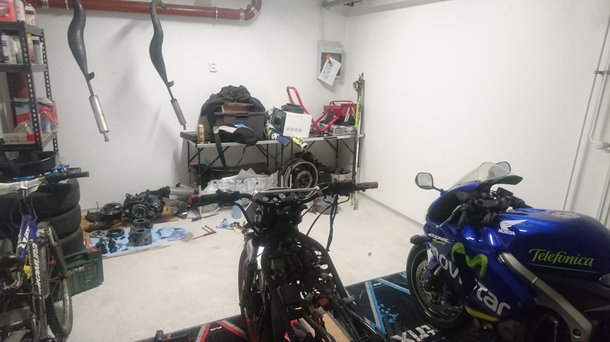

**Yamaha RD350** is my first motorcycle, a **350cc, twin cylinder, 2 stroke engine** from the year **1988**. 
The full name is Yamaha RD350 YPVS F2 -88, 1WT engine. I have had it since 2015.

Super fun bike to drive. It's very lightweight and power wheelies on first gears.

---

### Specs
- 350cc twin cylinder 2 stroke, 1WT engine
- Jolly moto exhaust
- V-Force reed valves
- 2x 28mm Mikuni flat slide carburetors
- Zeeltronic PCDI-10VT programmable ignition and exhaust valve controller
- Iridium spark plugs
- ~63HP on rear wheel
- Dry weight ~110 - 120kg ( This is an estimate, original dry weight is 141kg)

---

### Before and after
The after state is still missing rear fairings + rims and front fender should be painted. Also the bike has not been cleaned in a while.

On the left, the day I bought it and on the right some years later.

The bike also looked like this for a couple of years, but the rear fairing's fasterners kept breaking up from all the vibration, so I didn't want to
keep fixing them. Also It's nice to change the look of the bike every now and then.

---

### Restoration summary
The bike was undriveable when I got it and required a lot of work to fix it. It had countless problems, but the main issues that the bike had were here:
- Gas tank was covered in rust inside
- Gas lines and carburetors were covered in rust because of the gas tank.
- Carburetor settings were way off, engine didn't rev or run idle.
- Didn't rev or idle at all, also oil mixture was so bad that you couldn't see through the smoke from the exhaust.
- Didn't know the condition of the crank or the gearbox so engine overhaul was needed.
- Steering head bearing was completely done so that the handlebar couldn't be properly moved.
- Front fork oil seals were leaking.
- Bad battery
- Fairings had bad paint and looked like crap so new fairings and seat were needed and a paint job.
- A lot of weird "fixes" that the old owner had done which needed to be fixed again.

The bike had been sitting in a garage for the past 5+ years before I bought it so a complete engine rebuild 
and overhauling pretty much every part of the bike was necessary.

Didn't take too long until the bike was in this condition after buying it:

Can't remember all the details from the rebuild since I'm writing this 5 years after these photos. 
I'm just going through my old photos, adding some of them here and write what I can remember.

---

### Front forks
Front forks removed

Changing the front fork seals.

---

### Steering
Old top yoke steering bearing. The bike didn't handle very well because the **steering bearing** had some damage done to it. The steering would get a little bit
stuck everytime when the handle bar was straight.

New steering bearing fitted. New bearings were these taper roller bearings, old ones were ball bearings.

**New top yoke**. Had to buy it to be able to install a new handlebar that I bought. 
New handlebard wouldn't fit straight in because the old top yoke was meant for clip-on handle bars.

Fitting in a new handlebar. Though later on I have changed it to a different one.

---

### Rear swingarm
Rear swingarm, linkage and shocks looked like they had seen alot so I took them apart, bought new spacers + other parts and added
new lubrication.

Taking the rear swingarm apart.

Axle and spaces removed

Rear shock

Rear swingarm cleaned

Rear swingarm, linkage and shock cleaned.

---

### Engine and transmission
The engine didn't run very well and it was crazy to even run the engine without knowing the condition of it.
The engine had been sitting still for 5 years so it had to be taken apart and refurbish it.

Exhaust valve cable adjuster cover was broken, had to find a replacement from ebay

Taking the engine apart

Engine had probably seized at some point, piston and cylinder barrels didn't look so good

Scratches in the cylinder barrel. I had to send the cylinders to a machine shop so they could refurbish 
the cylinders by drilling a bigger hole in it.

Cleaning YPVS exhaust valves. Later on I ordered used YPVS valves from ebay. They arent cheap..

Next, taking the crank case apart. Starting from the clutch.

Had to make a tool to hold the clutch in place while loosening the nut + a little leverage for the ratchet 😁.

Behind the clutch

On the other side, removing the magneto.

Magneto removed

Taking the crank case apart

Crank case open

Crank and gearbox disassembled

Outer crank bearings were making noise so the crank had to be sent to the machine shop with the cylinders.
Crank was also measured properly in the machine shop to make sure it wasn't bent.

New pistons. Cylinder + crank arrived from the shop.

New V-Force reed valves for crispier revving.

Complete Gasket set, clutch plates + clutch springs and exhaust valve seal kit

Refurbished cylinder

Refurbished crank

One of the crank bearings was not properly in place when it arrived from the shop, no biggie.

A little crank bearing adjustment

Assembling the crank case and gearbox

Putting crank cases back together with some gasket sealant

Building the clutch.

Clutch plates in place

Building the top of the engine

Placing the piston rings to the cylinder to measure the piston ring clearance

Measuring piston ring clearance

Pistons and piston rings in place

Cylinders in place

Placing the cylinder head gasket

Assembling the cylinder head

Assembling the coolant hose and reed valves

Engine pretty much built up, thermostat missing still

Engine in place

**Transmission oil, coolant liquid and 2 stroke oil**. Carburetors, cooling system, YPVS and so on had to be assembled 
at this point also, didn't take pictures though, not that interesting. At the background there is one of the carburetors
diving in diesel to clean it, more on this in the **tank and fuel lines** section.

First start ! 😎

---

### Exhaust
Got to have some performance exhaust on two strokers. More lightweight, more power, better sounds.
I didn't find any recordings of my own of jolly moto pipes on RD, but here are some youtube clips:

- https://www.youtube.com/watch?v=f0G3IVtEQms ( Dyno clip, I have pretty much same specs as this bike )
- https://www.youtube.com/watch?v=iK_on_AbUfI ( Driving clip, bigger carburetors though )

Received the exhaust

Jolly moto wouldn't sell straight from the factory so I had to contact some swedish moped shop and order the pipes trough them,
they added some stickers and sunglasses to the package.

Jolly moto performance exhaust

Left pipe wouldn't fit because the spring holder on the kick stand would get in the way.

I relocated the spring holder by welding it to the other side of the kick stand

Exhaust fitted

---

### Tank and fuel lines
Most annoying part of this whole project was trying figure out how to remove the rust from the gas tank.
The rust would immediately clog the fuel filters and the jets in the carburetors.
I battled with this problem for weeks and tried several different methods.

Rust in the carburetor float bowl. This thick rust/fuel/oil mixture would clog the jets immediately.

Also the jets were in very bad shape. Probably not due to rust though. They had this weird coating on.

The needle jet broke way too easily.

### Removing the rust
**Method number 1**. I bought a liter of this expensive rust removal chemical from the local hardware store.

- https://m.motonet.fi/fi/tuote/602124/Dinitrol-Annitrol-Ruosteenpoistoaine-1l

First I removed the fuel tap and replaced it with this piece of plexi glass and an o-ring to prevent the chemical from flowing out.

The problem with this one was that this would only cover only a small portion of the gas tank. 
The chemical has to sit still for hours so doesn't help if you shake the tank.

Chemical removed. It did remove the rust from where the chemical was and a clear line with rust can be seen.

The tank had to be placed in all positions and hope that the chemical would clean the whole tank.

Placing the tank in different positions didn't really help because the spot where the chemical removed the rust 
would start to just rust almost immediately after removing the chemical.

Tried to check the tank for rust with this camera + light setup.

Lots of rust can be seen in the camera view on the laptop

So I had to give up with this one and come up with something better.

**Method number 2**. I went to a local agri market and bought 4 kilos of citric acid. This can be mixxed up with water so that it
covers the whole tank.

First I decided to put some screws to the tank so I could shake the tank and remove the biggest rust sections.

The screws worked quite well and I was able to remove this pile of rust from the tank

Filled the tank with citric acid and water mixture

I made a custom cap for the tank so that the acid would not break the seals on the normal fuel tank cap.

I let it sit there for a day, removed the acid and I could see the tank rusting before my eyes. So that didn't work out either.

**Method number 3**. I found this tank rust removal and zincing kit online for about 60€ and decided to try it. Can't remember the name of the kit sadly, it
was the method that finally worked. 

It had 3 parts, some rust removal chemical, some sort of anti rust chemical and finally a zinc paint. 

The rust removal
chemical would need to be added to the tank and shake it properly so that every part of the tank is covered. Then drain out the rust removal chemical and add the
anti rust chemical, again proper shaking required. Drain out the anti rust chemical and finally add the zinc paint to the tank and make sure the zinc covers every part
of the tank.

Draining the zinc paint out of the tank.

The result

I checked the insides of the tank last year ( 2019 ) and the zinc has stayed in there with zero rust. I added the zinc in the tank in 2015.

Taking the carbs apart

Cleaning the jets and other parts

Cleaning the fuel tap

I eventually changed the fuel tap entirely. Don't remember why, maybe it was broken or impossible to clean. Original Yamaha fuel tap.

Cleaning the carbs by placing them into diesel

---

### Fairings and paint
I think the bike looked like crap when I bought it so it had to be painted. Also the last owner build the rear fairing using wood
and what not so it weighted a ton. Had to buy new fairings because of it.

Took apart the wooden rear fairing thing from the last owner.

Found these original rear fairings from ebay

I hunted for this little piece for a month from the internet and this cost something like 75€! 
It belongs to the back of the seat, to the rear fairings connecting the right and left side.

Didn't know anyone with a 3d printer at the time, it would have been a lot cheaper and faster to just print one.

I had to also buy a new seat ( back there in the box ) because the old owner sawed the old seat in half to fit the wooden rear fairing. 

Got a new seat cover aswell

Removing the old seat cover

Old seat cover removed

New seat cover fitted to the seat. It is stapled on.

Testing how the seat would look like

Having some paints made at a paint shop, trying to select a color closest to the white leather on the seat cover.

Had these paint cans made. They are proper car paint in a spray can. There's also a primer, a lacquer 
and some acetone for cleaning the fairings and tank before painting.

Removing paint from the tank

Sanding the fairings to get rid of the old paint

Fixing some bumps and scratches with filler

Fairings and tank ready for painting

Fairings painted

Tank painted

Comparing the result to the front light mask

Comparing the result to the seat cover

Putting it all together

I was too lazy to sand the front fender because it is more a complex shaped piece so I didn't paint it. I thought I would
paint it later but at least haven't yet painted it 5 years later.

---

### Wheels
Original rear rim had a huge bump in it so it would wobble a lot while driving, new ones had to be hunted from ebay.

Bought rims on ebay

Found a pair of rims with tires and brake disks

Cleaned them and changed the wheel bearings

Also changed the sprockets and bought a new chain

Checking what would they look like fitted in

Rims changed

---

### Electronics
Old meters and headlight looked awful without front fairings and weighted a ton, so I decided to install a lightweight mask ligth.

Old wirings were a mess. Also includes all sorts of weird connections done by the old owners during the last 30 years.

New mask, blinkers and speed meter. I also bought a temperature meter for the liquid coolant 
( Temperature sensor is in the cylinder head, measuring the liquid coolant )

Koso speed meter

Testing the speed meter

Testing the front light.

Testing the arrow head blinkers

Had to change this old blinker relay as well to make the new LED blinkers work.

Testing temperature meter

Installed this programmable ignition + exhaust valve control system. Also bought it with this handheld programmer tool ( **Zeeltronic PCDI-10VT** ).

I installed it so that I could easily just remove the seat, plug in the programmer and adjust settings.

With the zeeltronic programmer, I can adjust the ignition timings and at which rpm area will the exhaust valve start to open and close.

 
---

### Summary
I have been writing this post quite some time now, mainly because finding good pictures from the old albums is time consuming, I think
it's best to end the post here.

These pictures include the main things I did during the restoration, but I have countless of pictures from after the restoration because 30 year old bikes
tend to break alot. Especially 2 stroke engines with a driving style like mine and when the total amount driven with this is somewhere around 80 000km. 

To be honest the bike has been like this for the past 2 yers.
Though I drove something like 12 000km with it before this state. Also I had to open the engine at least once during those 12 000 kilometers.

The engine has been in the back of my garage since the head gasket blew up.

Didn't find motivation to rebuild the engine yet since one of the cylinder head bolts has bigger threads than what can fit through the head gasket,
which is 3 layered metal gasket so it's not easy to drill it bigger without having the edges of the bolt holes thickening.

I have had all the required parts to fix it for a while now. Maybe during the next winter I'll finally fix it, not that big of a deal especially after
this sort of restoration.

