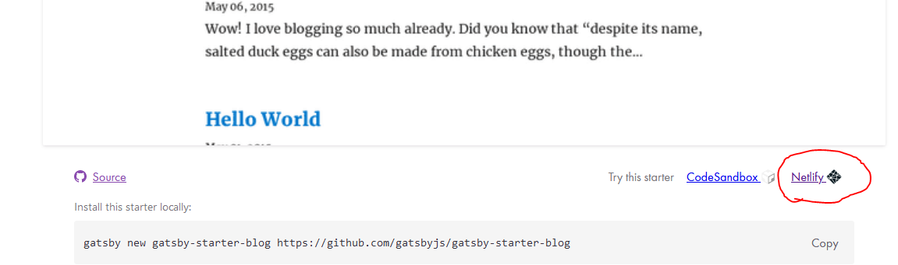
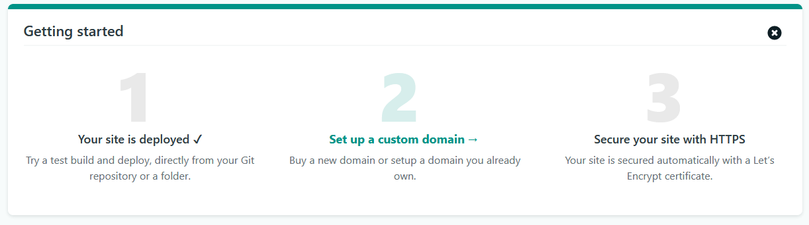

### About

Static websites are easy to setup, secure, low maintenance and they are fast. 
They can also be hosted on for example GitHub, so no need to pay for a host machine.

Google PageSpeed Insights:


I was a bit confused at first on what is the best way to set this thing up.
At first I followed the netlifycms "get started"-guide, but found out later that it's so much easier to setup straight
from the Gatsby Starter Library. So I thought I would add some notes on how to actually set this stack up.


### Setup a public site
1. Head on to <https://www.netlify.com/> and register if not registered already

2. Go to **Gatsby Starter Library**: <https://www.gatsbyjs.org/starters/> and **select a starter site**. I selected the 
gatsby-starter-blog because it's minimal and fast.

3. Scroll down a bit and click the little **Netlify** icon under the preview image to set it up


4. Click **Connect to GitHub** ( Or GitLab ).

5. Login and connect your account.

6. Set a **repository name** and click **Save & Deploy**

7. Wait for the site to deploy

8. Follow the 3 step process to setup domain and SSL for your site.


9. At this point, after finishing the 3 step process, the setup is already done. 
Allow some time for the DNS changes to take effect and your site will be online.

### Setup a local dev env:
1. Go to <https://github.com/> and login to your account ( or GitLab )
2. Netlify has created a repository for the gatsby site, **clone the repo**
3. **Download** and setup **NodeJS**: <https://nodejs.org/en/>
4. After installing, open **Node.js command prompt**
5. Move to your gatsby repo that you just cloned:

    ```cd your-gatsby-repo```
6. Install npm packages

    ```npm install```
7. Start gatsby server

    ```gatsby develop```
8. Local site is now up and running. Open browser and go to <http://localhost:8000/>

9. Start modifying the default blog posts, author and layout the way you want.


### Links
- <https://github.com/>
- <https://www.netlifycms.org/>
- <https://www.gatsbyjs.org/>
- <https://nodejs.org/en/>


